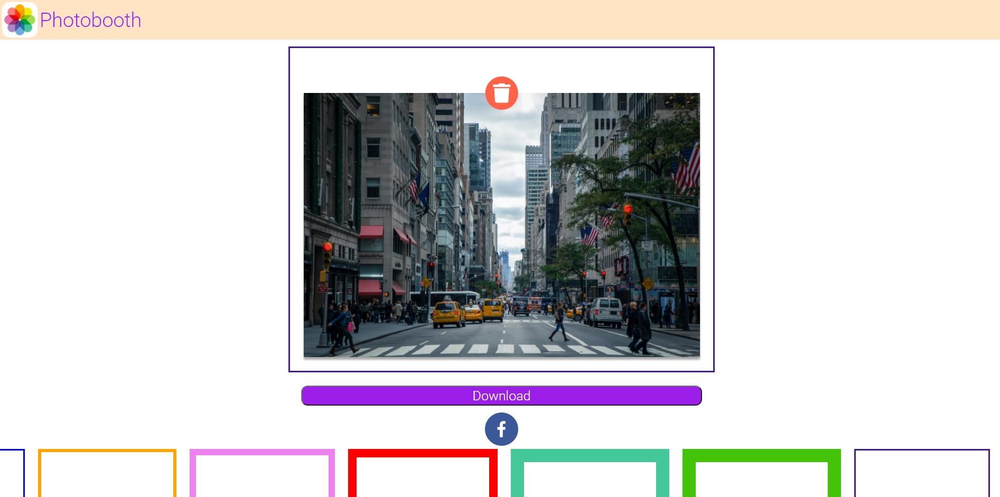

# PhotoBook App demo for Internship at TechKilla - by Ankur Paul

Deployed at https://photobooth-nooobcoder.vercel.app/

_Deploy your copy now on Vercel,_

Todos:

- [ ] Web based application to add frames to photos ✅
- [ ] Ability to preview the image with frames. ✅
- [ ] Ability to download the image. ✅
- [ ] Share to Facebook. ✅

## Instructions to run the app (How tos)

- `yarn start` to run the development server on port `1035` Modify the `port` value in `.env` (project-root) to customise the application port.
- `yarn build` to build the app and generate minified css and js for serving statically from a web server. Check the **build** folder (project-root), to obtain the built assets.

## Default package manager: Yarn (light)

A very clean React App starter template by [Ankur Paul](https://github.com/nooobcoder)

